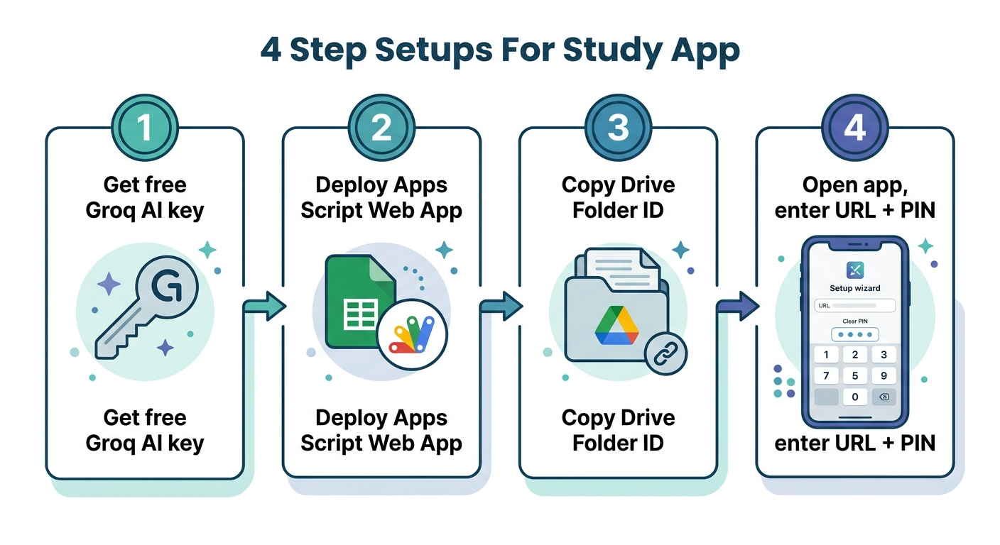

# 🎓 MEC CA Study Buddy  (Apps Script edition)

A free, mobile-responsive AI study assistant for a **Telangana Intermediate
First-Year MEC** student (Maths IA/IB, Economics, Commerce) preparing for **CA**.
Senior-CA-Professor chatbot + daily class diary memory + notes/diagram photo
backup. **Hinglish + English**, **PIN lock**, **multi-device**.



> Student: **Yeshaswini** · Telangana TSBIE Intermediate First Year (MEC)

**No Google Cloud Console. No Render web service for the backend.**
Everything (AI chat + Google Sheet memory + Drive photo backup) runs inside ONE
**Google Apps Script Web App** that you deploy from your own Sheet. The app is just
a static site that talks to that URL.

```
.
├── frontend/                 # Static site → host anywhere (Render Static Site / Netlify / GitHub Pages)
│   ├── index.html
│   ├── styles.css
│   └── app.js
└── appsscript_backend/       # Paste these into your Google Apps Script project
    ├── Code.gs
    └── appsscript.json
```

---

## 🟢 STEP 1 — Free AI key (2 min)
- Go to **https://console.groq.com** → sign in → **API Keys** → Create → copy `gsk_...`.
- (Optional fallback) Gemini key: https://aistudio.google.com/app/apikey

## 🟢 STEP 2 — Make the Sheet + deploy Apps Script (5 min)
1. Create a new **Google Sheet** (this becomes your memory database).
2. In the Sheet: **Extensions → Apps Script**.
3. Delete the default code, paste everything from **`appsscript_backend/Code.gs`**.
4. Click the gear **Project Settings → tick "Show appsscript.json manifest"**.
   Open `appsscript.json` in the editor and replace it with our
   **`appsscript_backend/appsscript.json`**.
5. **Deploy → New deployment → ⚙️ → Web app**
   - **Execute as:** Me
   - **Who has access:** Anyone
   - Click **Deploy**, accept the Google permission prompt (Allow).
6. Copy the **Web app URL** (ends with `/exec`). 👉 You'll paste this in the app wizard.

> The Drive folder ID, Photos album ID, Groq key, language and PIN are all set
> later **inside the app's Setup Wizard** — no need to edit the script.

## 🟢 STEP 3 — Get your backup IDs
- **Drive folder:** create a folder in Google Drive → open it → the URL is
  `drive.google.com/drive/folders/XXXX` → `XXXX` is your **Drive Folder ID**.
- **Photos album (optional):** ⚠️ Google Photos only lets an app add to albums
  *it created itself*, so a normal album ID usually won't accept uploads. Photos
  is best-effort — **Drive folder is the reliable photo backup.** Leave Photos blank
  if unsure.

## 🟢 STEP 4 — Host the frontend (static site)
1. Put the `frontend/` folder on any static host:
   - **Render → New → Static Site** (publish dir `frontend`), or Netlify drag-drop,
     or GitHub Pages. No build step needed.
2. Open the hosted URL → the **Setup Wizard** appears:
   - **Step 1:** paste the Apps Script Web App URL → *Test connection*.
   - **Step 2:** paste Drive Folder ID (+ optional Photos ID + Groq key), pick language.
   - **Step 3:** create your **PIN** → Finish.
3. Done! 🎉 On your phone it's fully responsive.

## 📱 Multi-device
On a second phone/laptop, open the same hosted URL → wizard sees the backend is
already set up → just **enter your PIN** → connected. All class diary + chat data
syncs because it lives in your Google Sheet.

## 🔒 Security
- PIN is **SHA-256 hashed** in the browser; only the hash is stored & sent.
- Every request to the Apps Script carries the PIN hash — wrong PIN = rejected.
- Your Groq key + IDs live in the Apps Script's Script Properties (server side),
  never in the static frontend.

## 🔁 If you change the Apps Script code later
Re-deploy: **Deploy → Manage deployments → Edit (pencil) → Version: New version → Deploy.**
(The URL stays the same.)

## 🧠 What the Sheet stores
- Tab **`Diary`**: `date | subject | topic | note` (your class memory)
- Tab **`Chat`**: `time | question | answer` (chat backup)
(The script auto-creates these tabs on first use.)
